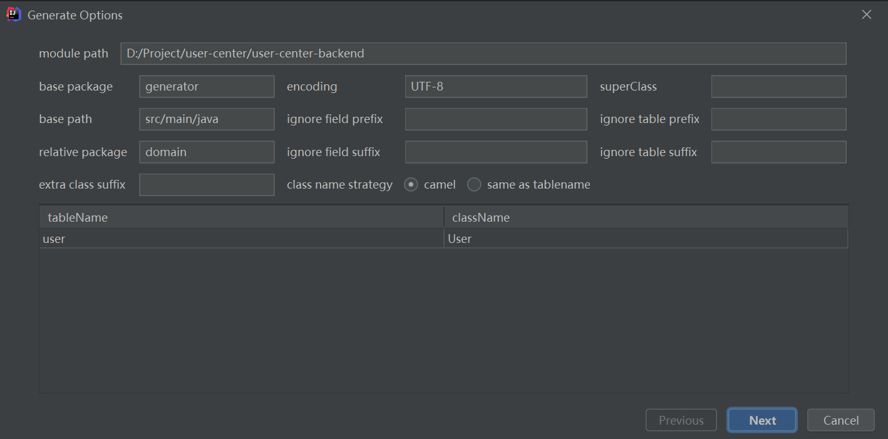
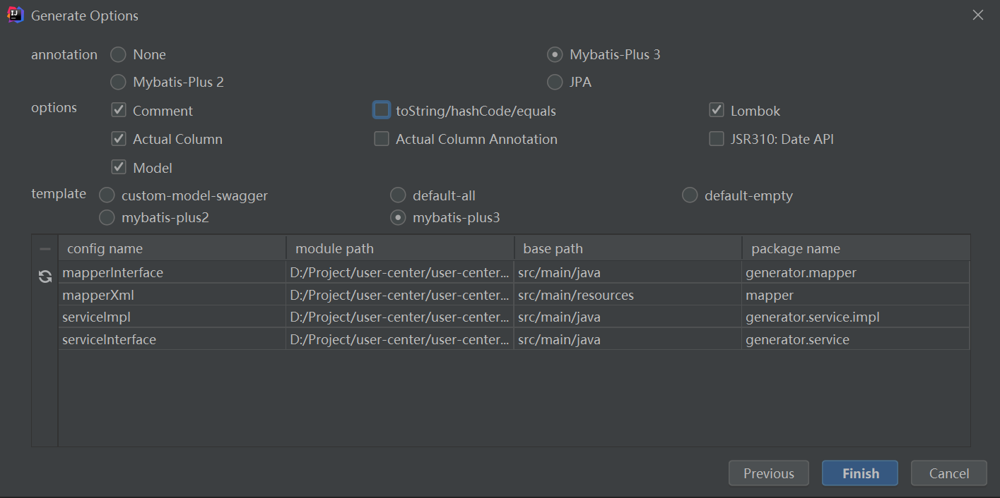

# 企业项目开发流程

1. 需求分析
2. 设计（概要设计、详细设计）
3. 技术选型（尤其是新项目）
4. 搭建项目（初始化/引入需要的技术）
5. 写Demo
6. 写代码（实现业务逻辑）
7. 测试（单元测试）
8. 代码提交/代码评审
9. 部署
10. 发布


# 需求分析

- 登录 / 注册
- 用户管理（仅管理员可见）
  - 对用户的改查
- 用户校验（权限管理）


# 技术选型

- 前端：
  - 三件套
  - React
  - 组件库 Ant Design（蚂蚁金服）
  - Umi（阿里开发框架）
  - Ant Design Pro（现成的管理系统）
- 后端：
  - Java
  - Spring
  - SpringMVC
  - MyBatis
  - MyBatis-plus
  - SpringBoot
  - MySQL
- 部署：
  - 服务器 / 容器（平台）


# 计划

1. 初始化项目
   - 前端初始化
     1. 初始化项目
     2. 引入组件
     3. 项目瘦身
   - 后端初始化
     1. 环境准备（MySQL）
     2. 整合框架
2. 数据库设计
3. 登录 / 注册功能
   - 后端
     - 注册
     - 登录（单机登录 => 后续改成分布式 / 第三方登录）
   - 前端
4. 用户管理接口（仅管理员）
   - 后端
     - 查询用户
     - 删除用户
   - 前端


# 初始化


## 前端初始化

### [Ant Design Pro](https://pro.ant.design/zh-CN/docs/getting-started/#%E5%88%9D%E5%A7%8B%E5%8C%96)

1. 全局安装pro-cli，只安装一次
   - `npm i @ant-design/pro-cli -g`
2. 创建初始化程序
   - `pro create myapp`
   - 一定要用umi@3！
3. 安装依赖
   - `cd myapp && yarn`
4. 运行 package.json 文件下的 script 中的 start
   - Node.js v18会导致start error，需要在start后的语句前加上`SET NODE_OPTIONS=--openssl-legacy-provider && `


### [Umi UI](https://v3.umijs.org/zh-CN/docs/use-umi-ui)

1. 当前项目终端内安装 Umi UI
   - `yarn add @umijs/preset-ui`
2. 安装完成后运行start
   - 出现找不到文件的error，解决方法：删除src下的.umi，然后重新安装Ant Design Pro的依赖
3. 在下方出现的悬浮球中可以添加区块和模板
   - 因为需要从GitHub上下载代码，所以加载区块和模板需要魔法
   - 最终还是没能添加模块成功，报错`FetchError: request to https://registry.npmjs.org/ failed, reason: connect ETIMEDOUT 2606:4700::6810:223:443`
   - Umi UI 兼容性不好！


### 生成的项目结构


- config：配置文件
- dist：部署项目目录
- mock：模拟数据
- public：静态资源(logo，视频，图片)
- src:
  - components：组件，可以复用
  - pages：页面
  - locales：国际化
  - e2e：集成测试
  - app.tsx：前端入口程序
  - global.less：全局样式
  - global.tsx：全局脚本文件
- .editconfig：编辑器配置
- .eslintrc.js：js代码规范
- .prettierrc.js：美化代码
- jest.config：测试工具
- playwright.config.ts：浏览器测试工具


### 前端瘦身

1. 去国际化
   - ./src/locales 就是国际化的目录
   - 执行 package.json 文件中的`i18n-remove`即可去国际化
2. 删除 e2e 集成测试
3. 删除 pages 下的页面时同时需要删除 config/routes 下的路由
4. 删除接口文档工具 services/swagger 和接口定义文件 config/oneapi.json 
   - 需要根据[官方文档](https://pro.ant.design/zh-CN/docs/openapi/)删除对应的openAPI配置，否则项目无法运行
5. 删除 tests 目录和 jest.config，自己做的前端项目一般不需要测试


## 后端初始化

### 生成SpringBoot项目

三种初始化Java项目的方式

- GitHub 搜 springboot-template 现成的代码
- SpringBoot官方模板生成器
- IDEA开发工具中生成（推荐）


- Spring Boot DevTools：热部署
- Spring Configuration Processor：读取properties文件


### 整合框架

整合 [MyBatis-Plus](https://baomidou.com/pages/226c21/)


引入缺少的依赖 [maven repository](https://mvnrepository.com/)


# 数据库设计


## 什么是设计数据库表？

有哪些表（模型）？表中有哪些字段？字段类型？数据库字段添加索引？

表与表之间的关联


## 用户表

id（主键）bigint

username 昵称 varchar

userAccount账号 varchar（注意account为关键字）

avatarUrl 头像 varchar

gender 性别 tinyint

userPassword 密码 varchar

phone 电话 varchar

email 邮箱 varchar

userStatus 用户状态 int 0 - 正常

userRole 用户角色 int 0 - 普通用户 1 - 管理员

nkuCode NKU学号 varchar

---

createTime 数据插入时间 datetime

updateTime 数据更新时间 datetime

isDelete 是否删除（逻辑删除）tinyint 0 1

```mysql
create table if not exists tong_universe.user
(
	id bigint auto_increment comment 'id'
		primary key,
	username varchar(256) null comment '用户昵称',
	userAccount varchar(256) null comment '账号',
	avatarUrl varchar(1024) null comment '用户头像',
	gender tinyint null comment '性别',
	userPassword varchar(512) not null comment '密码',
	phone varchar(128) null comment '电话',
	email varchar(512) null comment '邮箱',
	userStatus int default 0 not null comment '状态 0 - 正常',
	createTime datetime default CURRENT_TIMESTAMP null comment '创建时间',
	updateTime datetime default CURRENT_TIMESTAMP null on update CURRENT_TIMESTAMP comment '更新时间',
	isDelete tinyint default 0 not null comment '是否删除',
	userRole int default 0 not null comment '用户角色 0 - 普通用户 1  - 管理员',
	nkuCode varchar(512) null comment 'NKU学号'
)
comment '用户';
```


# 登录 / 注册功能


## 后端

### 整理项目目录


### 实现基本数据操作（操作user表）

模型user对象 => 和数据库的字段关联，自动生成


自动生成器的使用：

**MyBatisX** 插件，自动根据数据库生成domain实体类对象、mapper、mapper.xml、service







快速生成 setXxx 插件：**GenerateAllSetter**


踩坑：MyBatis-Plus 默认开启驼峰命名与下换线的映射转换，若数据库表已经用了驼峰命名，则需要在yml中设置关闭映射转换

```yml
mybatis-plus:
  configuration:
    map-underscore-to-camel-case: false
```


### 注册逻辑

1. 用户在前端输入账户、密码、以及校验码（todo）
2. 校验用户的账户、密码、校验密码是否合法
   1. 非空
   2. 账户不小于4位
   3. 密码不小于8位
   4. 账户不包含特殊字符
   5. 密码与校验密码相同
   6. 账户不能重复
3. 对密码进行加密（**密码千万不要明文存储在数据库中**）
4. 向数据库插入用户数据


### 注册代码实现细节

使用 StringUtils 类快速判断多个 String 是否为空

```xml
<!-- https://mvnrepository.com/artifact/org.apache.commons/commons-lang3 -->
<dependency>
    <groupId>org.apache.commons</groupId>
    <artifactId>commons-lang3</artifactId>
    <version>3.12.0</version>
</dependency>
```


加密类库：MessageDigest


### 登录逻辑

- 接收参数：用户账户、密码
- 请求类型：POST
- 请求体：JSON 格式的数据
- 返回值：用户信息（脱敏）

1. 校验用户账户和密码是否合法
   1. 非空
   2. 账户不小于4位
   3. 密码不小于8位
   4. 账户不包含特殊字符
2. 校验密码是否输入正确，和数据库中的密文密码对比
3. **用户信息脱敏**
4. 记录用户的登录态（session），存到服务器上（Tomcat）
5. 返回用户信息


如何知道是哪个用户登录了？

1. 连接服务器端后，得到一个 session 状态（匿名会话），返回给前端
2. 登录成功后，得到了登录成功的 session，并且给该 session 设置一些值（如用户信息），返回给前端一个设置 cookie 的“命令”
3. 前端接收到后端的命令后，设置 cookie，保存在浏览器内
4. 前端再次请求后端的时候（相同域名），在请求头中带上 cookie 去请求
5. 后端拿到的前端传来的 cookie，找到对应的 session
6. 后端从 session 中可以取出基于该 session 存储的变量（用户的登录信息、登录名）


### 登录代码实现细节

日志：添加``@Slf4j`注解，使用 log 的方法


踩坑：对于 isDelete 的用户不应该登录成功


详见 [MyBatis-Plus 官方文档 / 逻辑删除](https://baomidou.com/pages/6b03c5/#%E6%AD%A5%E9%AA%A4-1-%E9%85%8D%E7%BD%AEcom-baomidou-mybatisplus-core-config-globalconfig-dbconfig)


### 控制层 Controller 封装请求

插件 **Auto Filling Java Call Arguments** 快速填充参数


model 层新建 request 包，新建 UserRegisterRequest 用于封装用户注册请求体，添加序列号


controller 层倾向于对请求参数本身的校验，不涉及业务逻辑本身

service 层是对业务逻辑的校验


application.yml 制定接口全局 api

```yml
 servlet:
  context-path: /api
```


### 测试

点击 Controller 层左边的小图标即可


### 获取用户登录态

从 session 中拿到 currentUser 的 id，然后从数据库中查到用户的当前信息，并返回 safetyUser

注意不能直接返回 session 中拿到的currentUser，因为登录之后某些信息可能改变了


### 用户注销

从 session 中删除登录态即可


### 用户注册校验逻辑

校验用户必须为NKUer

仅适用于用户可信的情况，让用户自己填


用户表新增 nkuCode 字段

后台补充对编号的校验：长度、唯一性

前端补充输入框，适配后端

后期拉取星球数据，定期清理违规用户


## 前端

### 登录页面

登录页面底部：

user-center-frontend/src/components/Footer/index.tsx 更改 links 标签和 defaultMessage 


设置系统 logo 常量：

src 下新增 constant/index.ts文件，`export const SYSTEM_LOGO = "url"`


登录页面：

user-center-frontend/src/pages/user/Login/index.tsx 更改 LoginForm 标签


删！


### 登录接口

前端需要向后端发送请求

前端 Ajax 来请求后端

Axios 封装了 Ajax

request 是 Ant Design 又封装了一层


追踪 request 源码：用到了 umi 插件，requestConfig 是一个配置

[Ant Design Pro 官方文档](https://pro.ant.design/zh-CN/docs/upgrade-v5#%E8%AF%B7%E6%B1%82)说明了如何全局配置 base 请求路径


user-center-frontend/src/app.tsx 中

```tsx
import { RequestConfig } from 'umi';

export const request: RequestConfig = {
  timeout: 10000,
};
```


### 代理

正向代理：替客户端发送请求

反向代理：替服务器接收请求，转发给多台服务器


user-center-frontend/config/proxy.ts 中

```ts
  dev: {
    // localhost:8000/api/** -> https://preview.pro.ant.design/api/**
    '/api': {
      // 要代理的地址
      target: 'http://localhost:8080',
      // 配置了这个可以从 http 代理到 https
      // 依赖 origin 的功能可能需要这个，比如 cookie
      changeOrigin: true,
    },
```

代理成功后在所以请求路径前需要加上`/api`


怎么搞代理？

Nginx 服务器

Node.js 服务器


### 注册页面

复制 user-center-frontend/src/pages/user/Login 为 Register 文件夹，Login 修改为 Register


增加 /user/register 路由：

```ts
  {
    path: '/user',
    layout: false,
    routes: [
      {
        path: '/user', routes: [
          {name: '登录', path: '/user/login', component: './user/Login'},
          {name: '注册', path: '/user/register', component: './user/Register'}
        ]
      },
      {component: './404'},
    ],
  },
```


访问 user/register 时重定向到 login

原因：user-center-frontend/src/app.tsx 中

```tsx
// 若没有用户信息，重定向到 login
try {
    const msg = await queryCurrentUser();
    return msg.data;
} catch (error) {
    history.push(loginPath);
}

// 如果没有登录，重定向到 login
if (!initialState?.currentUser && location.pathname !== loginPath) {
    history.push(loginPath);
}
```

需要给 user/register 加入到白名单中


删！

复制 userPassword 增加一个 checkPassword


如何把“登录”按钮改为“注册”？

查看 LoginForm 标签的源码 user-center-frontend/node_modules/@ant-design/pro-form/lib/layouts/LoginForm/index.js 有：

```js
var submitter = proFormProps.submitter === false ? false : (0, _objectSpread2.default)((0, _objectSpread2.default)({
    searchConfig: {
        submitText: intl.getMessage('loginForm.submitText', '登录')
    },
```

在 user-center-frontend/src/pages/user/Register/index.tsx 的 LoginForm 标签中添加：

```tsx
<LoginForm
    submitter={{
        searchConfig:{
            submitText: '注册'
        }
    }}
```


设置 API.LoginParams 


### 注册接口

添加密码与确认密码相同的校验


user-center-frontend/src/services/ant-design-pro/api.ts 中新增 register 接口

返回值为“注册用户的id”

redirect 代表原先访问的页面被登录页面拦截，登录成功后跳转到原先访问的页面


### 获取当前用户登录信息

修改 user-center-frontend/src/app.tsx 中的 fetchUserInfo，包括 queryCurrentUser 和其中的 API.CurrentUser 都需要修改


登陆成功后右上角显示用户头像

user-center-frontend/src/components/RightContent/AvatarDropdown.tsx 中的 avatar 与用户表中的 avatarUrl 字段不匹配


### 用户注销适配后端

修改 user-center-frontend/src/components/RightContent/AvatarDropdown.tsx 中的 outLogin 方法，与后端设定的路由绑定


### 用户注册校验输入框

user-center-frontend/src/pages/user/Register/index.tsx 新增一个 ProFormText 标签

user-center-frontend/src/services/ant-design-pro/typings.d.ts 的 RegisterParams 和 CurrentUser 中均需要新增 nkuCode


## 待优化点 todo

- 前端密码重复提示（可能有其他优化方式）
- 注册失败没有友好提示


# 用户管理接口


## 后端

### 查询用户 / 删除用户

允许按用户名查询 / 按 id 删除


必须鉴权！！！


设置 session 失效时间：

```yml
spring:
  # session失效时间
  session:
    timeout: 86400
```


设置逻辑删除：User中记得加 @TableLogic 

```yml
mybatis-plus:
  global-config:
    db-config:
      logic-delete-field: isDelete # 全局逻辑删除的实体字段名(since 3.3.0,配置后可以忽略不配置步骤2)
      logic-delete-value: 1 # 逻辑已删除值(默认为 1)
      logic-not-delete-value: 0 # 逻辑未删除值(默认为 0)
```


## 前端

### 设置路由

user-center-frontend/config/routes.ts 下设置路由


设置路由后访问显示没有权限，因为需要让前端获取当前用户的 userRole

user-center-frontend/src/access.ts 中设置返回的 canAdmin 的值


### 用户管理页

user-center-frontend/src/pages/Admin.tsx 中删！新增一个 children 子页面


引入 [procomponents](https://procomponents.ant.design/components/table?tab=api&current=1&pageSize=5) 组件库中的高级表格

然后删！


通过 columns 定义表格有哪些列

- dataIndex 对应返回数据对象的属性
- title 表格列名
- copyable 是否允许复制
- ellipsis 是否允许缩略
- valueType 该列的类型（date，select）
- valueEnum 枚举值


踩坑：改 CurrentUser 时要用 API.CurrentUser ，不能 import ，否则报错找不到 api


头像渲染：render 属性 + Image 标签


# 代码优化

## 后端优化

1. 通用返回对象

   目的：给对象补充一些信息，告诉前端这个请求在业务层面上是成功还是失败

   ```json
   // 成功
   {
       "code":0 //业务状态码
       "data":{
       	"name":"tong"
   	},
   	"message":"ok"
   }
   
   // 错误
   {
       "code":50001 //业务状态码
       "data":null
   	"message":"用户操作异常"
   }
   ```

   - 定义 BaseResponse 类封装对象
   - 定义 ResultUtils 用来减少重复代码的书写
   - 定义响应码 Code
   - 返回类支持返回正常和错误

2. 封装全局异常处理

   1. 定义业务异常类 BusinessException

      - 相对于 Java 的异常类，支持更多字段
      - 自定义构造函数，更灵活快捷地设置字段

   2. 编写全局异常处理器

      作用：

      - 捕获代码中所有的异常，让前端得到更详细的业务报错 / 信息
      - 同时屏蔽掉项目框架本身的异常，不暴露服务器状态
      - 集中处理，记录日志

      实现：

      - Spring AOP：在调用方法前后提供额外的处理

3. todo 全局请求日志和登录校验


## 前端优化

1. 对接后端的返回值，取 data
2. 全局响应处理器
   1. 应用场景：需要对接口的 **通用响应** 进行统一处理，比如从 response 中取出 data，或者根据 code 去集中处理错误，比如用户未登陆，没权限之类的
   2. 优势：不用在每个接口请求都去写相同的逻辑
   3. 实现：[参考文章](https://blog.csdn.net/huantai3334/article/details/116780020)


# 多环境

1. 多环境
2. 项目部署上线
   - 原始部署方式
   - 宝塔 Linux
   - 容器
   - 容器平台
3. 前后端的联调
4. 项目拓展和规划（优化点）


## 多环境

[参考文章](https://blog.csdn.net/weixin_41701290/article/details/120173283)

本地开发：localhost（127.0.0.1）

多环境：指同一套项目代码在不同阶段需要根据实际情况来调整配置，并部署到不同的机器上


为什么需要？

1. 每个环境互不影响
2. 区分不同的阶段：开发 / 测试 / 生产
3. 对项目进行优化
   - 本地日志级别
   - 精简依赖、节省项目体积
   - 项目的环境 / 参数可以调整，比如 JVM 参数

针对不同环境做不同的事


多环境分类：

1. 本地环境（自己的电脑）localhost
2. 开发环境（远程开发）连同一台机器，为了大家开发
3. 测试环境（测试）开发 / 测试 / 产品，单元测试 / 性能测试 / 功能测试 / 系统集成测试，独立的数据库和服务器
4. 预发布环境（体验服）基本和正式环境一致， 正式的数据库，更严谨，查出更多问题
5. 正式环境（线上，公开对外访问的项目）尽量不要改动，保证上线前的代码可以“完美”运行


## 前端多环境实战

- 请求地址
  - 开发环境：localhost:8080
  - 线上环境：域名http://user-backend.code-nav.cn

使用了 umi 框架，build 时会自动传入 NODE_ENV == production 参数，start NODE_ENV 参数为 development

- 启动方式

  - 开发环境：npm run start（本地启动，监听端口，自动更新）

  - 线上环境：npm run build（项目构建打包），可以使用 serve 工具启动（npm i -g serve）

  - ```ts
    /**
     * 配置request请求时的默认参数
     */
    const request = extend({
      credentials: 'include',
      prefix: process.env.NODE_ENV === 'production'?'http://user-backend.code-nav.cn':undefined
    });
    ```

- 项目的配置

  不同的项目（框架）都有不同的配置文件，umi 的配置文件是 config.ts

  - 可以在配置文件后添加对应的环境名称后缀来区分开发环境和生产环境
  - 开发环境：config.development.ts
  - 生产环境：config.production.ts


## 后端多环境实战

SpringBoot 项目，通过 application.yml 添加不用的后缀来区分不同的环境，如 application-prod.yml

可以在启动项目时传入环境变量：`java -jar .\user-center-backend-.0.0.1-Snapshot.jar -- spring.profiles.active=prod`

主要是改：

- 依赖的环境地址：
  - 数据库地址
  - 缓存地址
  - 消息队列地址
  - 项目端口号
  - 服务器配置


# 项目部署

[参考文章](https://www.bilibili.com/read/cv16179200/?spm_id_from=333.999.0.0)

需要 Linux 服务器（建议用 CentOS 8+ / 7.6 以上）

腾讯云首次需要重置密码

Xshell 远程连接服务器的软件


## 原始部署

**前端**

需要 web 服务器：**Nginx**、Apache、Tomcat

安装 Nginx 服务器：

- 用系统自带的软件包管理器快速安装，比如 CentOS 的 yum
- 官网安装，[参考文章](https://blog.csdn.net/qq_65732918/article/details/131862373)
  1.  `curl -o 文件名称 下载地址`
  2. 解压 `tar -zxvf 文件名称`

`netstat -ntlp` 查看端口占用情况

本地 build 项目，将 dist 拖到服务器中


配置 nginx.conf 文件


`nginx -s reload`更新配置


**后端**

- Java
  - `yum install -y java-1.8.0-openjdk`
- Maven（或者本地打包完再上传）

`nohup java -jar jar包 --spring.profiles.active=prod &`

使用 `nohup` 命令行不会卡死

输入 `jobs` 即可查看运行的进程


## 宝塔 Linux 部署

重装服务器 - 应用镜像 - 宝塔 Linux 面板（或者官方教程）

宝塔 Linux 是一个运维面板，方便管理服务器，方便安装软件


通过宝塔安装 Nginx 和 Tomcat（会自动安装 Java）

添加站点 - 上传前端代码

添加 Java 项目（Tomcat 会占用8080端口，需要停止服务）


## Docker 部署

Docker 是容器，可以将项目依赖的环境（Java，Nginx）和项目代码一起打包成镜像，镜像更容易分发和移植，有权限即可下载

启动项目时不需要输入很多命令，而是直接下载镜像、启动镜像即可

Docker 可以理解为软件安装包


Docker 安装

- 官网
- 宝塔


DockerfIle 同于指定构建 Docker 镜像的方法，有现成的轮子

后端 DockerfIle 

```dockerfile
# Docker 镜像构建
# @author <a href="https://github.com/liyupi">程序员鱼皮</a>
# @from <a href="https://yupi.icu">编程导航知识星球</a>
FROM maven:3.5-jdk-8-alpine as builder

# Copy local code to the container image.
WORKDIR /app
COPY pom.xml .
COPY src ./src

# Build a release artifact.
RUN mvn package -DskipTests

# Run the web service on container startup.
CMD ["java","-jar","/app/target/user-center-backend-0.0.1-SNAPSHOT.jar","--spring.profiles.active=prod"]
```

- FROM 依赖的基础镜像
- WORKDIR 工作目录
- COPY 从本机复制文件
- RUN 执行命令
- CMD / ENTRUPOINT（附加额外参数）指定运行容器时默认执行的命令

根据 DockerfIle 构建镜像

```bash
docker build -t user-center-backend:v0.0.1
```


前端 DockerfIle 

```dockerfile
FROM nginx

WORKDIR /usr/share/nginx/html/
USER root

COPY ./docker/nginx.conf /etc/nginx/conf.d/default.conf

COPY ./dist  /usr/share/nginx/html/

EXPOSE 80

CMD ["nginx", "-g", "daemon off;"]
```

nginx.conf：

```
server {
    listen 80;

    # gzip config
    gzip on;
    gzip_min_length 1k;
    gzip_comp_level 9;
    gzip_types text/plain text/css text/javascript application/json application/javascript application/x-javascript application/xml;
    gzip_vary on;
    gzip_disable "MSIE [1-6]\.";

    root /usr/share/nginx/html;
    include /etc/nginx/mime.types;

    location / {
        try_files $uri /index.html;
    }

}
```

根据 DockerfIle 构建镜像

```bash
docker build -t user-center-frontend:v0.0.1
```


docker run 启动


# 项目上线

